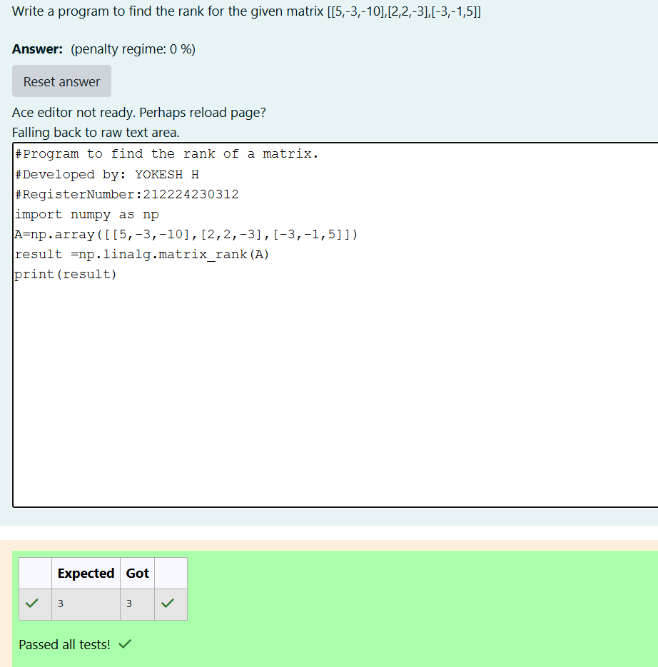

# RANK-OF-A-MATRIX
## Aim:
To write a python program to find the rank of a matrix
## Equipment’s required:
1. 	Hardware – PCs
2. 	Anaconda – Python 3.7 Installation / Moodle-Code Runner
## Algorithm:
### Step 1: Import the NumPy library for matrix operations.
### Step 2: Create a 2D NumPy array A to store the given matrix.
### Step 3: Using the np.linalg.matrix_rank(), we can find the rank of the given matrix.
### Step 4: Print the computed rank.
## Program:
```
#Program to find the rank of a matrix.
#Developed by: YOKESH H 
#RegisterNumber:212224230312
import numpy as np
A=np.array([[5,-3,-10],[2,2,-3],[-3,-1,5]])
result =np.linalg.matrix_rank(A)
print(result)
```
## Output:

## Result:
Thus the rank for the given matrix is successfully solved by  using a python program.

